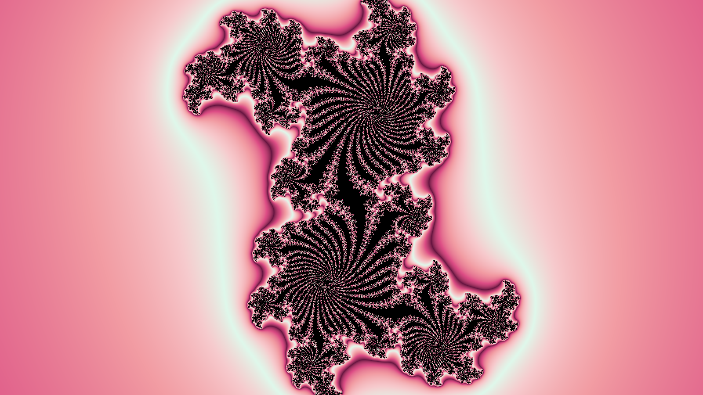

# JuliaCPP
## A Julia set renderer written in C++.

Written for my CS1 final project.

Here is the help output:

```
JuliaCPP [-B BOTTOMRIGHT] [-C CPARAM] [-O FILENAME] [-H HEIGHT] [-I ITERATIONS] [-R RADIUS] [-r RANDOMPALETTE] [-N THREADS] [-T TOPLEFT] [-W WIDTH] 
Generates images of the Julia set and saves them in PPM format.

Option Details:
  -B --bottomright          Set the bottom right coordinate of the area in the complex plane.
  -C --cparam               Set the complex parameter used in the Julia iteration.
  -O --filename             Set the name of the image file. The extension must be .ppm .
  -H --height               Set the pixel height of the image.
  -I --iterations           Set the number of iterations per pixel. This should be a positive integer.
  -R --radius               Set the escape radius of a point.
  -r --randompalette        Set the length of a random color palette to use with the image.
  -N --threads              Set the number of threads used for image rendering.
  -T --topleft              Set the top left coordinate of the area in the complex plane.
  -W --width                Set the pixel width of the image.

Note: complex parameters must be given as real,imag . For example, 1.0+1.0i should be entered as 1.0,1.0
```

I developed this program on macOS using clang, so there may be compilation errors when building on a different platform/compiler.
Try building with clang, and if there are still errors then feel free to submit an issue!


